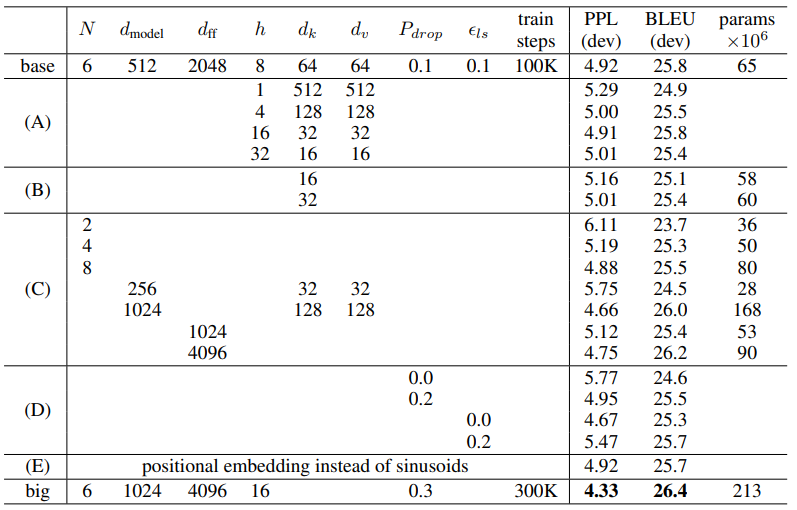
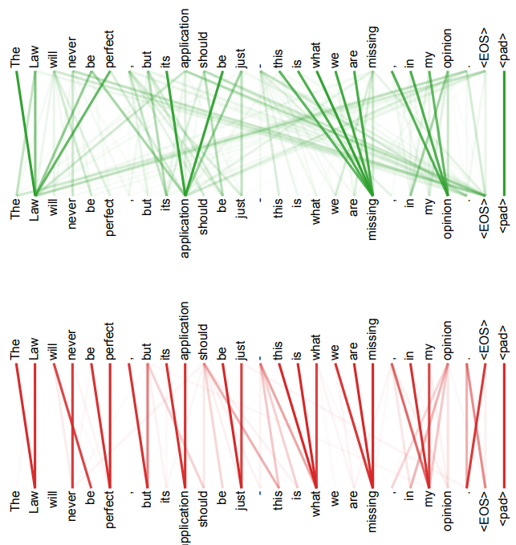

# Attention Is All You Need 注意力机制就是一切

## Abstract摘要

The dominant sequence transduction models are based on complex recurrent or convolutional neural networks that include an encoder and a decoder.
 主流的序列转导模型基于复杂的循环神经网络或卷积神经网络，包括编码器和解码器。

The best performing models also connect the encoder and decoder through an attention mechanism.
 表现最好的模型还通过注意力机制将编码器和解码器连接起来。

We propose a new simple network architecture, the Transformer, based solely on attention mechanisms, dispensing with recurrence and convolutions entirely.
 我们提出了一种新的简单网络架构——Transformer，完全基于注意力机制，完全不使用循环和卷积。

Experiments on two machine translation tasks show these models to be superior in quality while being more parallelizable and requiring significantly less time to train.
 在两个机器翻译任务上的实验表明，这些模型在质量上优于现有模型，同时具有更高的并行性，并且训练时间显著减少。

Our model achieves 28.4 BLEU on the WMT 2014 English-to-German translation task, improving over the existing best results, including ensembles, by over 2 BLEU.
 我们的模型在WMT 2014英语到德语翻译任务中达到了28.4 BLEU，超过了现有最好的结果（包括集成模型）2 BLEU以上。

On the WMT 2014 English-to-French translation task, our model establishes a new single-model state-of-the-art BLEU score of 41.8 after training for 3.5 days on eight GPUs, a small fraction of the training costs of the best models from the literature.
 在WMT 2014英语到法语翻译任务中，我们的模型在八个GPU上训练3.5天后，达到了41.8的BLEU分数，成为新的单模型最先进水平，而其训练成本仅为文献中最好的模型的很小一部分。

We show that the Transformer generalizes well to other tasks by applying it successfully to English constituency parsing both with large and limited training data.
 我们展示了Transformer在其他任务中的良好泛化能力，成功应用于大规模和有限训练数据的英语成分句法分析任务。

------
*Equal contribution. Listing order is random. Jakob proposed replacing RNNs with self-attention and started the effort to evaluate this idea.
 *等贡献，列举顺序随机。Jakob提出用自注意力替代RNN，并开始评估这个想法。

Ashish, with Illia, designed and implemented the first Transformer models and has been crucially involved in every aspect of this work.
 Ashish与Illia设计并实现了第一个Transformer模型，并在这项工作中的各个方面都发挥了至关重要的作用。

Noam proposed scaled dot-product attention, multi-head attention and the parameter-free position representation and became the other person involved in nearly every detail.
 Noam提出了缩放点积注意力、多头注意力和无参数位置表示，并成为参与几乎每个细节的另一位成员。

Niki designed, implemented, tuned and evaluated countless model variants in our original codebase and tensor2tensor.
 Niki设计、实现、调优并评估了我们原始代码库和tensor2tensor中的无数模型变体。

Llion also experimented with novel model variants, was responsible for our initial codebase, and efficient inference and visualizations.
 Llion还实验了新型模型变体，负责我们最初的代码库，以及高效的推理和可视化工作。

Lukasz and Aidan spent countless long days designing various parts of and implementing tensor2tensor, replacing our earlier codebase, greatly improving results and massively accelerating our research.
 Lukasz和Aidan花费了无数漫长的日子设计和实现tensor2tensor的各个部分，替换了我们早期的代码库，极大地提高了结果并大幅加速了我们的研究。

${ }^{\dagger}$ Work performed while at Google Brain.
 ${ }^{\dagger}$ 该工作是在Google Brain期间完成的。

${ }^{\ddagger}$ Work performed while at Google Research.
 ${ }^{\ddagger}$ 该工作是在Google Research期间完成的。

------

## 1 Introduction 引言

Recurrent neural networks, long short-term memory [13] and gated recurrent [7] neural networks in particular, have been firmly established as state of the art approaches in sequence modeling and transduction problems such as language modeling and machine translation [35, 2, 5].
 循环神经网络（RNN）、长短期记忆（LSTM）[13]和门控循环单元（GRU）[7]等神经网络，已经被确立为序列建模和转导问题（如语言建模和机器翻译）[35, 2, 5]的最先进方法。

Numerous efforts have since continued to push the boundaries of recurrent language models and encoder-decoder architectures [38, 24, 15].
 此后，许多努力继续推动递归语言模型和编码器-解码器架构的边界[38, 24, 15]。

Recurrent models typically factor computation along the symbol positions of the input and output sequences.
 递归模型通常将计算分解到输入和输出序列的符号位置上。

Aligning the positions to steps in computation time, they generate a sequence of hidden states $h_t$, as a function of the previous hidden state $h_{t-1}$ and the input for position $t$.
 将这些位置与计算时间的步骤对齐，它们生成一系列隐藏状态$h_t$，作为前一个隐藏状态$h_{t-1}$和位置$t$的输入的函数。

This inherently sequential nature precludes parallelization within training examples, which becomes critical at longer sequence lengths, as memory constraints limit batching across examples.
 这种内在的顺序性阻止了训练样本中的并行化，特别是在序列较长时，内存限制使得跨样本批处理变得困难。

Recent work has achieved significant improvements in computational efficiency through factorization tricks [21] and conditional computation [32], while also improving model performance in case of the latter.
 近期的研究通过因式分解技巧[21]和条件计算[32]在计算效率上取得了显著改善，同时在后者的情况下也提高了模型性能。

The fundamental constraint of sequential computation, however, remains.
 然而，顺序计算的基本限制依然存在。

## 2 Background 背景

The goal of reducing sequential computation also forms the foundation of the Extended Neural GPU [16], ByteNet [18] and ConvS2S [9], all of which use convolutional neural networks as basic building block, computing hidden representations in parallel for all input and output positions.
 减少顺序计算的目标也构成了扩展神经GPU [16]、ByteNet [18]和ConvS2S [9]的基础，这些模型都使用卷积神经网络作为基本构建块，为所有输入和输出位置并行计算隐藏表示。

In these models, the number of operations required to relate signals from two arbitrary input or output positions grows in the distance between positions, linearly for ConvS2S and logarithmically for ByteNet.
 在这些模型中，将信号从两个任意输入或输出位置关联所需的操作数随着位置间距离的增大而增加，ConvS2S是线性增长，ByteNet是对数增长。

This makes it more difficult to learn dependencies between distant positions [12].
 这使得学习远距离位置之间的依赖关系变得更加困难[12]。

In the Transformer this is reduced to a constant number of operations, albeit at the cost of reduced effective resolution due to averaging attention-weighted positions, an effect we counteract with Multi-Head Attention as described in section 3.2.
 在Transformer中，这一问题被减少为恒定数量的操作，尽管由于对加权位置进行平均处理，导致有效分辨率降低，但我们通过多头注意力机制（在第3.2节中描述）来对抗这一影响。

Self-attention, sometimes called intra-attention is an attention mechanism relating different positions of a single sequence in order to compute a representation of the sequence.
 自注意力，有时称为内部注意力，是一种将单一序列中不同位置关联起来的注意力机制，用于计算该序列的表示。

Self-attention has been used successfully in a variety of tasks including reading comprehension, abstractive summarization, textual entailment and learning task-independent sentence representations [4, 27, 28, 22].
 自注意力机制已经成功应用于多种任务，包括阅读理解、抽象总结、文本蕴涵和学习任务无关的句子表示[4, 27, 28, 22]。

End-to-end memory networks are based on a recurrent attention mechanism instead of sequence-aligned recurrence and have been shown to perform well on simple-language question answering and language modeling tasks [34].
 端到端的记忆网络基于递归注意力机制，而非序列对齐的递归，已被证明在简单语言的问答和语言建模任务中表现良好[34]。

To the best of our knowledge, however, the Transformer is the first transduction model relying entirely on self-attention to compute representations of its input and output without using sequence-aligned RNNs or convolution.
 然而，据我们所知，Transformer是第一个完全依赖自注意力来计算输入和输出表示的转导模型，而不使用序列对齐的RNN或卷积。

In the following sections, we will describe the Transformer, motivate self-attention and discuss its advantages over models such as [17, 18] and [9].
 在接下来的部分中，我们将描述Transformer，阐明自注意力的动机，并讨论它相较于模型[17, 18]和[9]的优势。

## 3 Model Architecture 模型架构

Most competitive neural sequence transduction models have an encoder-decoder structure [5, 2, 35].
 大多数竞争性的神经序列转导模型都具有编码器-解码器结构[5, 2, 35]。

Here, the encoder maps an input sequence of symbol representations $\left(x_1, \ldots, x_n\right)$ to a sequence of continuous representations $z =\left(z_1, \ldots, z_n\right)$.
 在这里，编码器将符号表示的输入序列$\left(x_1, \ldots, x_n\right)$映射到连续表示的序列$z =\left(z_1, \ldots, z_n\right)$。

Given $z$, the decoder then generates an output sequence $\left(y_1, \ldots, y_m\right)$ of symbols one element at a time.
 给定$z$，解码器然后生成一个符号的输出序列$\left(y_1, \ldots, y_m\right)$，一次生成一个元素。

At each step the model is auto-regressive [10], consuming the previously generated symbols as additional input when generating the next.
 在每一步，模型是自回归的[10]，在生成下一个符号时，使用先前生成的符号作为额外输入。

------

Figure 1: The Transformer - model architecture.
 图1：Transformer模型架构。

------

The Transformer follows this overall architecture using stacked self-attention and point-wise, fully connected layers for both the encoder and decoder, shown in the left and right halves of Figure 1, respectively.
 Transformer遵循这一总体架构，使用堆叠的自注意力和逐点全连接层来构建编码器和解码器，分别展示在图1的左半部分和右半部分。

### 3.1 Encoder and Decoder Stacks 编码器和解码器堆栈

Encoder: The encoder is composed of a stack of $N=6$ identical layers.
 编码器：编码器由堆叠的$N=6$个相同的层组成。

Each layer has two sub-layers.
 每个层有两个子层。

The first is a multi-head self-attention mechanism, and the second is a simple, positionwise fully connected feed-forward network.
 第一个是多头自注意力机制，第二个是简单的逐位置全连接前馈网络。

We employ a residual connection [11] around each of the two sub-layers, followed by layer normalization [1].
 我们在每个子层周围采用残差连接[11]，然后进行层归一化[1]。

That is, the output of each sub-layer is LayerNorm $(x+\operatorname{Sublayer}(x))$, where $\operatorname{Sublayer}(x)$ is the function implemented by the sub-layer itself.
 也就是说，每个子层的输出是LayerNorm $(x+\operatorname{Sublayer}(x))$，其中$\operatorname{Sublayer}(x)$是该子层实现的函数。

To facilitate these residual connections, all sub-layers in the model, as well as the embedding layers, produce outputs of dimension $d_{\text {model }}=512$.
 为了促进这些残差连接，模型中的所有子层以及嵌入层都生成维度为$d_{\text {model }}=512$的输出。

Decoder: The decoder is also composed of a stack of $N=6$ identical layers.
 解码器：解码器也由堆叠的$N=6$个相同的层组成。

In addition to the two sub-layers in each encoder layer, the decoder inserts a third sub-layer, which performs multi-head attention over the output of the encoder stack.
 除了每个编码器层中的两个子层，解码器还插入了第三个子层，该子层对编码器堆叠的输出执行多头注意力。

Similar to the encoder, we employ residual connections around each of the sub-layers, followed by layer normalization.
 与编码器类似，我们在每个子层周围采用残差连接，之后进行层归一化。

We also modify the self-attention sub-layer in the decoder stack to prevent positions from attending to subsequent positions.
 我们还修改了解码器堆叠中的自注意力子层，以防止位置关注后续位置。

This masking, combined with fact that the output embeddings are offset by one position, ensures that the predictions for position $i$ can depend only on the known outputs at positions less than $i$.
 这种掩蔽操作，再加上输出嵌入偏移一个位置，确保位置$i$的预测只能依赖于位置小于$i$的已知输出。

### 3.2 Attention 注意力

An attention function can be described as mapping a query and a set of key-value pairs to an output, where the query, keys, values, and output are all vectors.
 一个注意力函数可以描述为将查询和一组键值对映射到输出，其中查询、键、值和输出都是向量。

The output is computed as a weighted sum of the values, where the weight assigned to each value is computed by a compatibility function of the query with the corresponding key.
 输出被计算为值的加权和，其中分配给每个值的权重是由查询与对应键的兼容性函数计算得出的。

------

Figure 2: (left) Scaled Dot-Product Attention. (right) Multi-Head Attention consists of several attention layers running in parallel.
 图2：（左）缩放点积注意力。（右）多头注意力由多个注意力层并行运行组成。

------

#### 3.2.1 Scaled Dot-Product Attention **缩放点积注意力**

We call our particular attention "Scaled Dot-Product Attention" (Figure 2).
 我们称我们的特定注意力为“缩放点积注意力”（图2）。

The input consists of queries and keys of dimension $d_k$, and values of dimension $d_v$.
 输入由维度为$d_k$的查询和键，以及维度为$d_v$的值组成。

We compute the dot products of the query with all keys, divide each by $\sqrt{d_k}$, and apply a softmax function to obtain the weights on the values.
 我们计算查询与所有键的点积，将每个点积除以$\sqrt{d_k}$，然后应用softmax函数以获得对值的权重。

In practice, we compute the attention function on a set of queries simultaneously, packed together into a matrix $Q$.
 在实践中，我们在一组查询上同时计算注意力函数，将它们打包成一个矩阵$Q$。

The keys and values are also packed together into matrices $K$ and $V$.
 键和值也被打包成矩阵$K$和$V$。

We compute the matrix of outputs as:
 我们将输出矩阵计算为：

$\text { Attention }(Q, K, V)=\operatorname{softmax}\left(\frac{Q K^T}{\sqrt{d_k}}\right) V$

The two most commonly used attention functions are additive attention [2], and dot-product (multiplicative) attention.
 最常用的两种注意力函数是加性注意力[2]和点积（乘法）注意力。

Dot-product attention is identical to our algorithm, except for the scaling factor of $\frac{1}{\sqrt{d_k}}$.
 点积注意力与我们的算法相同，唯一不同的是$\frac{1}{\sqrt{d_k}}$的缩放因子。

Additive attention computes the compatibility function using a feed-forward network with a single hidden layer.
 加性注意力使用具有单个隐藏层的前馈网络来计算兼容性函数。

While the two are similar in theoretical complexity, dot-product attention is much faster and more space-efficient in practice, since it can be implemented using highly optimized matrix multiplication code.
 尽管两者在理论复杂度上相似，但在实践中，点积注意力要快得多且更节省空间，因为它可以通过高度优化的矩阵乘法代码实现。

While for small values of $d_k$ the two mechanisms perform similarly, additive attention outperforms dot product attention without scaling for larger values of $d_k$ [3].
 虽然对于小的$d_k$值，两个机制的表现相似，但对于较大的$d_k$值，加性注意力在没有缩放的情况下优于点积注意力[3]。

We suspect that for large values of $d_k$, the dot products grow large in magnitude, pushing the softmax function into regions where it has extremely small gradients ${ }^4$.
 我们怀疑，对于较大的$d_k$值，点积的大小会变得很大，导致softmax函数进入梯度极小的区域${ }^4$。

To counteract this effect, we scale the dot products by $\frac{1}{\sqrt{d_k}}$.
 为了抵消这一效果，我们通过$\frac{1}{\sqrt{d_k}}$缩放点积。

#### **3.2.2 Multi-Head Attention** 多头注意力

Instead of performing a single attention function with $d_{\text {model }}$-dimensional keys, values and queries, we found it beneficial to linearly project the queries, keys and values $h$ times with different, learned linear projections to $d_k, d_k$ and $d_v$ dimensions, respectively.
 我们发现与其使用$d_{\text {model }}$维度的键、值和查询执行单一的注意力函数，不如将查询、键和值分别通过不同的学习到的线性投影投影$h$次，投影到$d_k, d_k$和$d_v$维度上更有利。

On each of these projected versions of queries, keys and values we then perform the attention function in parallel, yielding $d_v$-dimensional output values.
 然后，我们在这些投影版本的查询、键和值上并行执行注意力函数，得到$d_v$维的输出值。

These are concatenated and once again projected, resulting in the final values, as depicted in Figure 2.
 这些输出被连接在一起，再次进行投影，得到最终的值，如图2所示。

Multi-head attention allows the model to jointly attend to information from different representation subspaces at different positions.
 多头注意力允许模型同时关注来自不同表示子空间的不同位置的信息。

With a single attention head, averaging inhibits this.
 使用单一的注意力头时，平均化会抑制这一点。

$\begin{aligned} \operatorname{MultiHead}(Q, K, V) & =\operatorname{Concat}\left(\operatorname{head}_1, \ldots, \operatorname{head}_{h}\right) W^O \\ \text { where head } & =\operatorname{Attention}\left(Q W_i^Q, K W_i^K, V W_i^V\right) \end{aligned}$

Where the projections are parameter matrices $W_i^Q \in R ^{d_{\text {model }} \times d_k}, W_i^K \in R ^{d_{\text {model }} \times d_k}, W_i^V \in R ^{d_{\text {model }} \times d_v}$ and $W^O \in R ^{h d_v \times d_{\text {model }}}$.
 其中，投影是参数矩阵$W_i^Q \in R^{d_{\text {model }} \times d_k}, W_i^K \in R^{d_{\text {model }} \times d_k}, W_i^V \in R^{d_{\text {model }} \times d_v}$和$W^O \in R^{h d_v \times d_{\text {model }}}$。

In this work we employ $h=8$ parallel attention layers, or heads.
 在这项工作中，我们使用了$h=8$个并行注意力层，或称为注意力头。

For each of these we use $d_k=d_v=d_{\text {model }} / h=64$.
 对于每一个注意力头，我们使用$d_k=d_v=d_{\text {model }} / h=64$。

Due to the reduced dimension of each head, the total computational cost is similar to that of single-head attention with full dimensionality.
 由于每个头的维度减小，总的计算成本类似于单头注意力的全维度计算成本。

------

${ }^4$ To illustrate why the dot products get large, assume that the components of $q$ and $k$ are independent random variables with mean 0 and variance 1.
 ${ }^4$ 为了说明为什么点积会变大，假设$q$和$k$的分量是均值为0、方差为1的独立随机变量。

Then their dot product, $q \cdot k=\sum_{i=1}^{d_k} q_i k_i$, has mean 0 and variance $d_k$.
 然后它们的点积，$q \cdot k=\sum_{i=1}^{d_k} q_i k_i$，均值为0，方差为$d_k$。

------

#### **3.2.3 Applications of Attention in our Model** 我们模型中注意力的应用

The Transformer uses multi-head attention in three different ways:
 Transformer在三种不同的方式中使用多头注意力：

- In "encoder-decoder attention" layers, the queries come from the previous decoder layer, and the memory keys and values come from the output of the encoder.
   在“编码器-解码器注意力”层中，查询来自先前的解码器层，内存的键和值来自编码器的输出。

  This allows every position in the decoder to attend over all positions in the input sequence.
   这使得解码器中的每个位置都可以关注输入序列中的所有位置。

  This mimics the typical encoder-decoder attention mechanisms in sequence-to-sequence models such as [38, 2, 9].
   这类似于序列到序列模型中的典型编码器-解码器注意力机制，如[38, 2, 9]。

- The encoder contains self-attention layers.
   编码器包含自注意力层。

  In a self-attention layer all of the keys, values and queries come from the same place, in this case, the output of the previous layer in the encoder.
   在自注意力层中，所有的键、值和查询都来自同一位置，在这种情况下，是编码器中前一层的输出。

  Each position in the encoder can attend to all positions in the previous layer of the encoder.
   编码器中的每个位置都可以关注编码器中前一层的所有位置。

- Similarly, self-attention layers in the decoder allow each position in the decoder to attend to all positions in the decoder up to and including that position.
   类似地，解码器中的自注意力层允许解码器中的每个位置关注解码器中所有的位置，直到并包括该位置。

  We need to prevent leftward information flow in the decoder to preserve the auto-regressive property.
   我们需要防止解码器中的信息向左流动，以保持自回归特性。

  We implement this inside of scaled dot-product attention by masking out (setting to $-\infty$) all values in the input of the softmax which correspond to illegal connections.
   我们通过在缩放点积注意力中实现这一点，屏蔽（设置为$-\infty$）softmax输入中对应非法连接的所有值。

  See Figure 2.
   见图2。

### **3.3 Position-wise Feed-Forward Networks** 逐位置前馈网络

In addition to attention sub-layers, each of the layers in our encoder and decoder contains a fully connected feed-forward network, which is applied to each position separately and identically.
 除了注意力子层，我们的编码器和解码器中的每个层还包含一个全连接的前馈网络，它被单独且相同地应用于每个位置。

This consists of two linear transformations with a ReLU activation in between.
 它由两个线性变换组成，中间加上ReLU激活函数。

$\operatorname{FFN}(x)=\max \left(0, x W_1+b_1\right) W_2+b_2$

While the linear transformations are the same across different positions, they use different parameters from layer to layer.
 尽管线性变换在不同位置上相同，但它们在不同的层之间使用不同的参数。

Another way of describing this is as two convolutions with kernel size 1.
 另一种描述方式是将其视为两个大小为1的卷积。

The dimensionality of input and output is $d_{\text {model }}=512$, and the inner-layer has dimensionality $d_{f f}=2048$.
 输入和输出的维度为$d_{\text {model }}=512$，内层的维度为$d_{f f}=2048$。

### **3.4 Embeddings and Softmax** 嵌入与Softmax

Similarly to other sequence transduction models, we use learned embeddings to convert the input tokens and output tokens to vectors of dimension $d_{\text {model }}$.
 与其他序列转导模型类似，我们使用学习的嵌入将输入标记和输出标记转换为维度为$d_{\text {model }}$的向量。

We also use the usual learned linear transformation and softmax function to convert the decoder output to predicted next-token probabilities.
 我们还使用通常的学习线性变换和softmax函数将解码器输出转换为预测的下一个标记的概率。

In our model, we share the same weight matrix between the two embedding layers and the pre-softmax linear transformation, similar to [30].
 在我们的模型中，我们在两个嵌入层和预softmax线性变换之间共享相同的权重矩阵，类似于[30]。

In the embedding layers, we multiply those weights by $\sqrt{d_{\text {model }}}$.
 在嵌入层中，我们将这些权重乘以$\sqrt{d_{\text {model }}}$。

**Table 1: Maximum path lengths, per-layer complexity and minimum number of sequential operations for different layer types.**
 **表1：不同层类型的最大路径长度、每层复杂度和最小序列操作数。**

| **Layer Type (层类型)**                          | **Complexity per Layer (每层复杂度)** | **Sequential Operations (序列操作数)** | **Maximum Path Length (最大路径长度)** |
| ------------------------------------------------ | ------------------------------------- | -------------------------------------- | -------------------------------------- |
| Self-Attention (自注意力)                        | $O\left(n^2 \cdot d\right)$           | $O(1)$                                 | $O(1)$                                 |
| Recurrent (循环神经网络)                         | $O\left(n \cdot d^2\right)$           | $O(n)$                                 | $O(n)$                                 |
| Convolutional (卷积神经网络)                     | $O\left(k \cdot n \cdot d^2\right)$   | $O(1)$                                 | $O\left(\log _k(n)\right)$             |
| Self-Attention (restricted) (自注意力（限制版）) | $O(r \cdot n \cdot d)$                | $O(1)$                                 | $O(n / r)$                             |

### **3.5 Positional Encoding** 位置编码

Since our model contains no recurrence and no convolution, in order for the model to make use of the order of the sequence, we must inject some information about the relative or absolute position of the tokens in the sequence.
 由于我们的模型不包含循环和卷积，为了让模型利用序列的顺序，我们必须注入一些关于标记在序列中的相对或绝对位置的信息。

To this end, we add "positional encodings" to the input embeddings at the bottoms of the encoder and decoder stacks.
 为此，我们在编码器和解码器堆栈的底部，将“位置编码”添加到输入嵌入中。

The positional encodings have the same dimension $d_{\text {model }}$ as the embeddings, so that the two can be summed.
 位置编码与嵌入具有相同的维度$d_{\text {model }}$，以便两者可以相加。

There are many choices of positional encodings, learned and fixed [9].
 位置编码有许多选择，既有学习的也有固定的[9]。

In this work, we use sine and cosine functions of different frequencies:
 在这项工作中，我们使用不同频率的正弦和余弦函数：

$\begin{aligned} P E_{(p o s, 2 i)} & =\sin \left(p o s / 10000^{2 i / d_{\text {model }}}\right) \\ P E_{(p o s, 2 i+1)} & =\cos \left(p o s / 10000^{2 i / d_{\text {model }}}\right) \end{aligned}$

where pos is the position and $i$ is the dimension.
 其中，pos是位置，$i$是维度。

That is, each dimension of the positional encoding corresponds to a sinusoid.
 也就是说，位置编码的每个维度对应一个正弦波。

The wavelengths form a geometric progression from $2 \pi$ to $10000 \cdot 2 \pi$.
 波长形成从$2 \pi$到$10000 \cdot 2 \pi$的几何级数。

We chose this function because we hypothesized it would allow the model to easily learn to attend by relative positions, since for any fixed offset $k, P E_{p o s+k}$ can be represented as a linear function of $P E_{\text {pos }}$.
 我们选择了这个函数，因为我们假设它可以让模型轻松学习根据相对位置进行注意，因为对于任何固定偏移量$k$，$P E_{p o s+k}$可以表示为$P E_{\text {pos }}$的线性函数。

We also experimented with using learned positional embeddings [9] instead, and found that the two versions produced nearly identical results (see Table 3 row (E)).
 我们还尝试使用学习的位置嵌入[9]，并发现这两种版本产生了几乎相同的结果（见表3，第(E)行）。

We chose the sinusoidal version because it may allow the model to extrapolate to sequence lengths longer than the ones encountered during training.
 我们选择了正弦版本，因为它可能允许模型推断出比训练期间遇到的序列长度更长的序列。

## **4 Why Self-Attention** 为什么选择自注意力

In this section we compare various aspects of self-attention layers to the recurrent and convolutional layers commonly used for mapping one variable-length sequence of symbol representations $\left(x_1, \ldots, x_n\right)$ to another sequence of equal length $\left(z_1, \ldots, z_n\right)$, with $x_i, z_i \in R ^d$, such as a hidden layer in a typical sequence transduction encoder or decoder.
 在本节中，我们将自注意力层与常用于将一个可变长度的符号表示序列$\left(x_1, \ldots, x_n\right)$映射到另一个等长的序列$\left(z_1, \ldots, z_n\right)$（如典型的序列转导编码器或解码器中的隐藏层）的循环层和卷积层进行比较。

Motivating our use of self-attention we consider three desiderata.
 我们考虑自注意力的使用动机，并提出三个需求。

One is the total computational complexity per layer.
 一个是每层的总计算复杂度。

Another is the amount of computation that can be parallelized, as measured by the minimum number of sequential operations required.
 另一个是可以并行化的计算量，通过所需的最少顺序操作数来衡量。

The third is the path length between long-range dependencies in the network.
 第三个是网络中长距离依赖关系的路径长度。

Learning long-range dependencies is a key challenge in many sequence transduction tasks.
 学习长距离依赖关系是许多序列转导任务中的关键挑战。

One key factor affecting the ability to learn such dependencies is the length of the paths forward and backward signals have to traverse in the network.
 影响学习这些依赖关系能力的一个关键因素是信号在网络中向前和向后传递的路径长度。

The shorter these paths between any combination of positions in the input and output sequences, the easier it is to learn long-range dependencies [12].
 输入和输出序列中任何位置组合之间的路径越短，学习长距离依赖关系就越容易[12]。

Hence we also compare the maximum path length between any two input and output positions in networks composed of the different layer types.
 因此，我们还比较了由不同层类型组成的网络中，任何两个输入和输出位置之间的最大路径长度。

As noted in Table 1, a self-attention layer connects all positions with a constant number of sequentially executed operations, whereas a recurrent layer requires $O(n)$ sequential operations.
 如表1所示，自注意力层通过恒定数量的顺序执行操作连接所有位置，而循环层需要$O(n)$顺序操作。

In terms of computational complexity, self-attention layers are faster than recurrent layers when the sequence length $n$ is smaller than the representation dimensionality $d$, which is most often the case with sentence representations used by state-of-the-art models in machine translations, such as word-piece [38] and byte-pair [31] representations.
 在计算复杂度方面，当序列长度$n$小于表示维度$d$时，自注意力层比循环层更快，这通常是现代机器翻译模型（如word-piece [38]和byte-pair [31]表示法）中使用的句子表示的情况。

To improve computational performance for tasks involving very long sequences, self-attention could be restricted to considering only a neighborhood of size $r$ in the input sequence centered around the respective output position.
 为了提高涉及非常长序列任务的计算性能，可以限制自注意力仅考虑输入序列中围绕相应输出位置的大小为$r$的邻域。

This would increase the maximum path length to $O(n / r)$.
 这将把最大路径长度增加到$O(n / r)$。

We plan to investigate this approach further in future work.
 我们计划在未来的工作中进一步研究这种方法。

A single convolutional layer with kernel width $k does not connect all pairs of input and output positions.
 单个宽度为$k的卷积层不会连接所有输入和输出位置的对。

Doing so requires a stack of $O(n / k)$ convolutional layers in the case of contiguous kernels, or $O\left(\log _k(n)\right)$ in the case of dilated convolutions [18], increasing the length of the longest paths between any two positions in the network.
 这样做需要堆叠$O(n / k)$个卷积层（如果是连续卷积核）或$O\left(\log _k(n)\right)$（如果是扩张卷积）[18]，从而增加网络中任何两个位置之间最长路径的长度。

Convolutional layers are generally more expensive than recurrent layers, by a factor of $k$.
 卷积层通常比循环层更昂贵，增加了$k$倍的计算量。

Separable convolutions [6], however, decrease the complexity considerably, to $O\left(k \cdot n \cdot d+n \cdot d^2\right)$.
 然而，可分离卷积[6]显著降低了复杂度，降至$O\left(k \cdot n \cdot d+n \cdot d^2\right)$。

Even with $k=n$, however, the complexity of a separable convolution is equal to the combination of a self-attention layer and a point-wise feed-forward layer, the approach we take in our model.
 即使$k=n$，可分离卷积的复杂度仍然等于自注意力层和逐点前馈层的组合，这是我们模型中采用的方法。

As side benefit, self-attention could yield more interpretable models.
 作为附加好处，自注意力可能会产生更易解释的模型。

We inspect attention distributions from our models and present and discuss examples in the appendix.
 我们检查模型中的注意力分布，并在附录中展示并讨论示例。

Not only do individual attention heads clearly learn to perform different tasks, many appear to exhibit behavior related to the syntactic and semantic structure of the sentences.
 不仅各个注意力头显然学会了执行不同的任务，许多注意力头似乎还表现出与句子语法和语义结构相关的行为。

## **5 Training** 训练

This section describes the training regime for our models.
 本节描述了我们模型的训练方案。

### **5.1 Training Data and Batching** 训练数据与批处理

We trained on the standard WMT 2014 English-German dataset consisting of about 4.5 million sentence pairs.
 我们使用标准的WMT 2014英德数据集进行训练，该数据集包含约450万个句子对。

Sentences were encoded using byte-pair encoding [3], which has a shared source-target vocabulary of about 37000 tokens.
 句子使用字节对编码[3]进行编码，该编码具有大约37000个标记的共享源目标词汇。

For English-French, we used the significantly larger WMT 2014 English-French dataset consisting of 36 M sentences and split tokens into a 32000 word-piece vocabulary [38].
 对于英法翻译，我们使用了大得多的WMT 2014英法数据集，包含3600万句子，并将标记拆分成32000个word-piece词汇[38]。

Sentence pairs were batched together by approximate sequence length.
 句子对按大致的序列长度进行批处理。

Each training batch contained a set of sentence pairs containing approximately 25000 source tokens and 25000 target tokens.
 每个训练批次包含一组句子对，其中大约有25000个源语言标记和25000个目标语言标记。

### **5.2 Hardware and Schedule** 硬件与计划

We trained our models on one machine with 8 NVIDIA P100 GPUs.
 我们在一台配备8个NVIDIA P100 GPU的机器上训练模型。

For our base models using the hyperparameters described throughout the paper, each training step took about 0.4 seconds.
 对于使用本文中描述的超参数的基础模型，每个训练步骤大约需要0.4秒。

We trained the base models for a total of 100,000 steps or 12 hours.
 我们将基础模型训练了总计100,000步，或12小时。

For our big models, (described on the bottom line of table 3), step time was 1.0 seconds.
 对于我们的“大模型”（见表3底部），每步时间为1.0秒。

The big models were trained for 300,000 steps (3.5 days).
 大模型训练了300,000步（3.5天）。

### **5.3 Optimizer** 优化器

We used the Adam optimizer [20] with $\beta_1=0.9, \beta_2=0.98$ and $\epsilon=10^{-9}$.
 我们使用了Adam优化器[20]，其中$\beta_1=0.9, \beta_2=0.98$ 和 $\epsilon=10^{-9}$。

We varied the learning rate over the course of training, according to the formula:
 我们在训练过程中根据以下公式调整学习率：

$\text{lrate} = d_{\text{model}}^{-0.5} \cdot \min\left( \text{step\_num}^{-0.5}, \text{step\_num} \cdot \text{warmup\_steps}^{-1.5} \right)$

This corresponds to increasing the learning rate linearly for the first warmup_steps training steps, and decreasing it thereafter proportionally to the inverse square root of the step number.
 这意味着在前$\text{warmup\_steps}$次训练步骤中，学习率线性增加，然后在此之后根据步骤数的平方根的倒数进行减少。

We used warmup_steps $=4000$.
 我们使用了$\text{warmup\_steps} = 4000$。

### **5.4 Regularization** 正则化

We employ three types of regularization during training:
 我们在训练过程中使用了三种正则化方法：

------

**Table 2:** The Transformer achieves better BLEU scores than previous state-of-the-art models on the English-to-German and English-to-French newstest2014 tests at a fraction of the training cost.
 **表2：**Transformer在英德和英法newstest2014测试中，比之前的最先进模型取得了更好的BLEU分数，且训练成本仅为其一小部分。

------

**Residual Dropout**
 We apply dropout [33] to the output of each sub-layer, before it is added to the sub-layer input and normalized.
 我们对每个子层的输出应用dropout [33]，在它被加到子层输入并进行归一化之前。

In addition, we apply dropout to the sums of the embeddings and the positional encodings in both the encoder and decoder stacks.
 此外，我们还对编码器和解码器堆栈中嵌入和位置编码的和应用dropout。

For the base model, we use a rate of $P_{\text {drop }}=0.1$.
 对于基础模型，我们使用$P_{\text {drop }}=0.1$的rate。

**Label Smoothing**
 During training, we employed label smoothing of value $\epsilon_{l_s}=0.1$ [36].
 在训练过程中，我们使用了标签平滑，值为$\epsilon_{l_s}=0.1$ [36]。

This hurts perplexity, as the model learns to be more unsure, but improves accuracy and BLEU score.
 这会影响困惑度，因为模型学会了变得更加不确定，但会提高准确性和BLEU分数。

## **6 Results** 结果

### **6.1 Machine Translation ** 机器翻译

On the WMT 2014 English-to-German translation task, the big transformer model (Transformer (big) in Table 2) outperforms the best previously reported models (including ensembles) by more than 2.0 BLEU, establishing a new state-of-the-art BLEU score of 28.4.
 在WMT 2014英德翻译任务中，大型Transformer模型（表2中的Transformer (big)）超过了之前报告的最好的模型（包括集成模型）2.0 BLEU以上，创造了28.4的新最先进BLEU分数。

The configuration of this model is listed in the bottom line of Table 3.
 该模型的配置列在表3的底部。

Training took 3.5 days on 8 P100 GPUs.
 在8个P100 GPU上训练花费了3.5天。

Even our base model surpasses all previously published models and ensembles, at a fraction of the training cost of any of the competitive models.
 即使是我们的基础模型，也超越了所有已发布的模型和集成模型，且训练成本仅为任何竞争模型的一小部分。

On the WMT 2014 English-to-French translation task, our big model achieves a BLEU score of 41.0, outperforming all of the previously published single models, at less than $1 / 4$ the training cost of the previous state-of-the-art model.
 在WMT 2014英法翻译任务中，我们的大模型达到了41.0的BLEU分数，超过了所有已发布的单模型，且训练成本仅为之前最先进模型的四分之一以下。

The Transformer (big) model trained for English-to-French used dropout rate $P_{\text {drop }}=0.1$, instead of 0.3.
 用于英法翻译的Transformer (big)模型使用了$P_{\text {drop }}=0.1$的dropout率，而不是0.3。

For the base models, we used a single model obtained by averaging the last 5 checkpoints, which were written at 10-minute intervals.
 对于基础模型，我们使用了通过平均最后5个检查点得到的单个模型，这些检查点是在10分钟间隔内写入的。

For the big models, we averaged the last 20 checkpoints.
 对于大模型，我们平均了最后20个检查点。

We used beam search with a beam size of 4 and length penalty $\alpha=0.6$ [38].
 我们使用了束搜索，束宽为4，长度惩罚$\alpha=0.6$ [38]。

These hyperparameters were chosen after experimentation on the development set.
 这些超参数是在开发集上实验后选定的。

We set the maximum output length during inference to input length +50, but terminate early when possible [38].
 我们在推理过程中将最大输出长度设置为输入长度+50，但在可能的情况下提前终止[38]。

Table 2 summarizes our results and compares our translation quality and training costs to other model architectures from the literature.
 表2总结了我们的结果，并将我们的翻译质量和训练成本与文献中其他模型架构进行了比较。

We estimate the number of floating point operations used to train a model by multiplying the training time, the number of GPUs used, and an estimate of the sustained single-precision floating-point capacity of each GPU ${ }^5$.
 我们通过将训练时间、使用的GPU数量和每个GPU的持续单精度浮点运算能力的估算值相乘，来估计训练一个模型所用的浮点运算数${ }^5$。

### **6.2 Model Variations 模型变种**

To evaluate the importance of different components of the Transformer, we varied our base model in different ways, measuring the change in performance on English-to-German translation on the development set, newstest2013.
 为了评估Transformer中不同组件的重要性，我们以不同方式变化了基础模型，并测量了在英语到德语翻译开发集newstest2013上的性能变化。

------

${ }^5$ We used values of 2.8, 3.7, 6.0 and 9.5 TFLOPS for K80, K40, M40 and P100, respectively.
 ${ }^5$ 我们分别为K80、K40、M40和P100使用了2.8、3.7、6.0和9.5 TFLOPS的值。

------

Table 3: Variations on the Transformer architecture. Unlisted values are identical to those of the base model.
 表3：Transformer架构的变种。未列出的值与基础模型相同。

All metrics are on the English-to-German translation development set, newstest2013.
 所有度量标准都来自英语到德语翻译开发集newstest2013。

Listed perplexities are per-wordpiece, according to our byte-pair encoding, and should not be compared to per-word perplexities.
 列出的困惑度是基于我们的字节对编码的每个词片段计算的，因此不应与基于每个单词的困惑度进行比较。

------

We used beam search as described in the previous section, but no checkpoint averaging.
 我们使用了前一节中描述的束搜索，但没有使用检查点平均。

We present these results in Table 3.
 我们在表3中展示了这些结果。

In Table 3 rows (A), we vary the number of attention heads and the attention key and value dimensions, keeping the amount of computation constant, as described in Section 3.2.2.
 在表3的(A)行中，我们变化了注意力头数以及注意力键和值的维度，保持计算量不变，正如第3.2.2节所描述的。

While single-head attention is 0.9 BLEU worse than the best setting, quality also drops off with too many heads.
 虽然单头注意力比最佳设置差0.9 BLEU，但当头数过多时，质量也会下降。

In Table 3 rows (B), we observe that reducing the attention key size $d_k$ hurts model quality.
 在表3的(B)行中，我们观察到减少注意力键的大小$d_k$会损害模型质量。

This suggests that determining compatibility is not easy and that a more sophisticated compatibility function than dot product may be beneficial.
 这表明，确定兼容性并不容易，且比点积更复杂的兼容性函数可能会更有益。

We further observe in rows (C) and (D) that, as expected, bigger models are better, and dropout is very helpful in avoiding over-fitting.
 我们进一步观察到在(C)行和(D)行中，正如预期的那样，较大的模型表现更好，而丢弃法在避免过拟合方面非常有帮助。

In row (E) we replace our sinusoidal positional encoding with learned positional embeddings [9], and observe nearly identical results to the base model.
 在(E)行中，我们将正弦位置编码替换为学习到的位置嵌入[9]，并观察到与基础模型几乎相同的结果。

### **6.3 English Constituency Parsing 英语成分分析**

To evaluate if the Transformer can generalize to other tasks we performed experiments on English constituency parsing.
 为了评估Transformer是否能推广到其他任务，我们进行了英语成分分析的实验。

This task presents specific challenges: the output is subject to strong structural constraints and is significantly longer than the input.
 这个任务有特定的挑战：输出受强结构约束，并且显著长于输入。

Furthermore, RNN sequence-to-sequence models have not been able to attain state-of-the-art results in small-data regimes [37].
 此外，RNN序列到序列模型在小数据环境下未能达到最先进的结果[37]。

We trained a 4-layer transformer with $d_{\text {model }}=1024$ on the Wall Street Journal (WSJ) portion of the Penn Treebank [25], about 40K training sentences.
 我们在Penn Treebank [25]的《华尔街日报》（WSJ）部分上训练了一个4层的Transformer，模型维度$d_{\text{model}}=1024$，大约40K的训练句子。

We also trained it in a semi-supervised setting, using the larger high-confidence and BerkleyParser corpora from with approximately 17 M sentences [37].
 我们还在半监督设置下进行了训练，使用了更大的高置信度和BerkleyParser语料库，约17百万句子[37]。

We used a vocabulary of 16 K tokens for the WSJ only setting and a vocabulary of 32 K tokens for the semi-supervised setting.
 对于仅使用WSJ的设置，我们使用了16K的词汇表；对于半监督设置，我们使用了32K的词汇表。

We performed only a small number of experiments to select the dropout, both attention and residual (section 5.4), learning rates and beam size on the Section 22 development set, all other parameters remained unchanged from the English-to-German base translation model.
 我们只进行了少量实验，以选择在第22节开发集上的丢弃率、注意力和残差（第5.4节）、学习率和束搜索大小，其他所有参数保持与英语到德语基础翻译模型相同。

During inference, we increased the maximum output length to input length +300.
 在推理过程中，我们将最大输出长度增加到输入长度+300。

------

Table 4: The Transformer generalizes well to English constituency parsing (Results are on Section 23 of WSJ)
 表4：Transformer对英语成分分析具有良好的泛化能力（结果在WSJ的第23节）

------

We used a beam size of 21 and $\alpha=0.3$ for both WSJ only and the semi-supervised setting.
 我们为WSJ仅使用和半监督设置都使用了21的束搜索大小和$\alpha=0.3$。

Our results in Table 4 show that despite the lack of task-specific tuning our model performs surprisingly well, yielding better results than all previously reported models with the exception of the Recurrent Neural Network Grammar [8].
 表4中的结果表明，尽管缺乏任务特定的调优，我们的模型表现出奇地好，取得了比所有先前报告的模型更好的结果，唯一例外的是递归神经网络语法[8]。

In contrast to RNN sequence-to-sequence models [37], the Transformer outperforms the BerkeleyParser [29] even when training only on the WSJ training set of 40 K sentences.
 与RNN序列到序列模型[37]相比，Transformer即使仅在40K句子的WSJ训练集上进行训练，也优于BerkeleyParser[29]。

## **7 Conclusion 结论**

In this work, we presented the Transformer, the first sequence transduction model based entirely on attention, replacing the recurrent layers most commonly used in encoder-decoder architectures with multi-headed self-attention.
 在这项工作中，我们提出了Transformer，这是第一个完全基于注意力机制的序列转换模型，使用多头自注意力替换了编码器-解码器架构中最常用的递归层。

For translation tasks, the Transformer can be trained significantly faster than architectures based on recurrent or convolutional layers.
 对于翻译任务，Transformer的训练速度显著快于基于递归或卷积层的架构。

On both WMT 2014 English-to-German and WMT 2014 English-to-French translation tasks, we achieve a new state of the art.
 在WMT 2014英语到德语和WMT 2014英语到法语的翻译任务中，我们达到了新的最先进水平。

In the former task our best model outperforms even all previously reported ensembles.
 在前一个任务中，我们的最佳模型甚至超过了所有先前报告的集成模型。

We are excited about the future of attention-based models and plan to apply them to other tasks.
 我们对基于注意力机制的模型的未来感到兴奋，并计划将其应用于其他任务。

We plan to extend the Transformer to problems involving input and output modalities other than text and to investigate local, restricted attention mechanisms to efficiently handle large inputs and outputs such as images, audio and video.
 我们计划将Transformer扩展到涉及文本以外的输入和输出模式的问题，并研究局部限制注意力机制，以有效处理大型输入和输出，如图像、音频和视频。

Making generation less sequential is another research goal of ours.
 使生成过程变得不那么顺序化是我们的另一个研究目标。

The code we used to train and evaluate our models is available at https://github.com/tensorflow/tensor2tensor.
 我们用于训练和评估模型的代码可以在https://github.com/tensorflow/tensor2tensor上找到。

Acknowledgements We are grateful to Nal Kalchbrenner and Stephan Gouws for their fruitful comments, corrections and inspiration.
 致谢 我们感谢Nal Kalchbrenner和Stephan Gouws提供的有益评论、修正和启发。

------

## Attention Visualizations 注意力可视化

Figure 3: An example of the attention mechanism following long-distance dependencies in the encoder self-attention in layer 5 of 6.
 图3：一个示例，展示了在第6层编码器自注意力中，注意力机制如何跟踪远距离依赖关系。

Many of the attention heads attend to a distant dependency of the verb 'making', completing the phrase 'making...more difficult'.
 许多注意力头关注动词“making”的远距离依赖，完成了短语“making...more difficult”。

Attentions here shown only for the word 'making'.
 这里只展示了针对单词“making”的注意力。

Different colors represent different heads. Best viewed in color.
 不同的颜色代表不同的注意力头。最佳效果请使用彩色显示。

------

Figure 4: Two attention heads, also in layer 5 of 6, apparently involved in anaphora resolution.
 图 4：第 5 层的两个注意力头，显然与指代解析有关。

Top: Full attentions for head 5.
 顶部：第 5 个注意力头的完整注意力。

Bottom: Isolated attentions from just the word 'its' for attention heads 5 and 6.
 底部：仅来自单词“its”的注意力，针对第 5 和第 6 个注意力头。

Note that the attentions are very sharp for this word.
 请注意，这个词的注意力非常集中。

------

Figure 5: Many of the attention heads exhibit behaviour that seems related to the structure of the sentence.
 图 5：许多注意力头表现出似乎与句子结构相关的行为。

We give two such examples above, from two different heads from the encoder self-attention at layer 5 of 6.
 我们上面给出了两个例子，来自第 5 层的编码器自注意力的两个不同注意力头。

The heads clearly learned to perform different tasks.
 这些注意力头显然学会了执行不同的任务。
